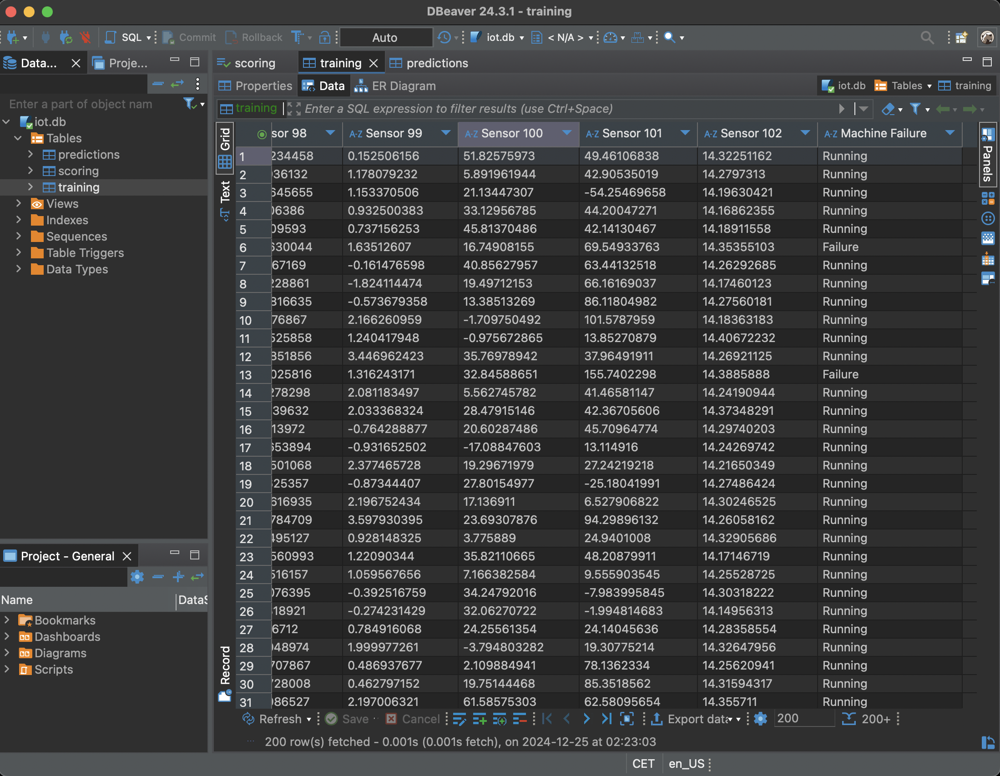
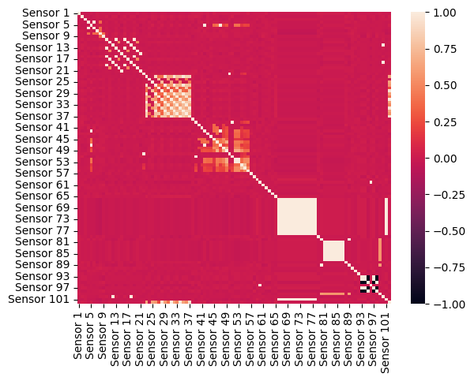
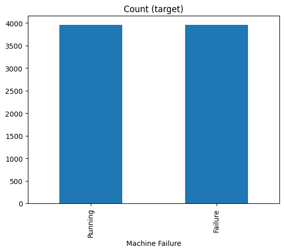
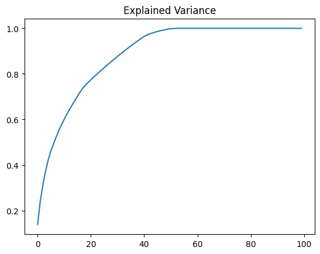
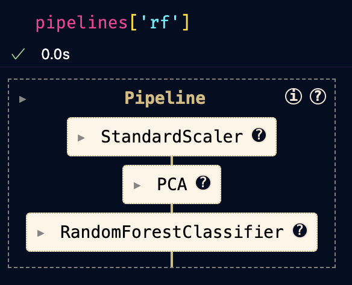
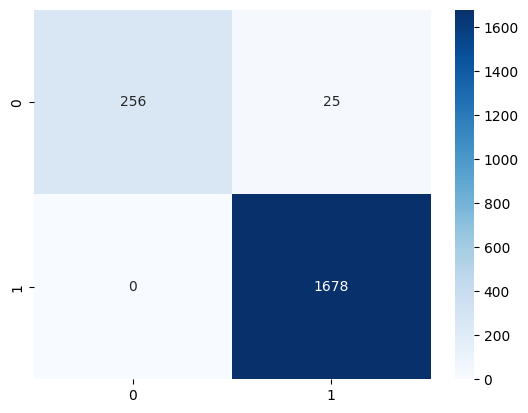

# Machine Failure Detection with PCA and Classification 🚀

## 1. **Exploratory Data Analysis (EDA)** and Data Preprocessing

- **Manejo de valores nulos**: Se utilizaron técnicas de imputación para reemplazar los valores nulos de características clave.
- **Codificación de variables categóricas**: Se aplicó One-Hot Encoding para las variables categóricas.
- **Normalización y escalado**: Se utilizó **PCA (Análisis de Componentes Principales)** para reducir la dimensionalidad y escalado de las características.

## 2. **Model Selection** Using Multiple Classifiers (e.g., Logistic Regression, RandomForest, GradientBoosting, XGBoost)

- **Logistic Regression**: Regresión logística para clasificar el estado de la máquina.
- **Random Forest Classifier**: Utilizando múltiples árboles para manejar relaciones complejas entre características.
- **Gradient Boosting Classifier**: Modelo de boosting para mejorar la precisión.
- **XGBoost Classifier**: Un modelo de boosting avanzado optimizado para rapidez y eficiencia.

La **PCA** se usó para reducir la dimensionalidad del conjunto de características y mejorar el rendimiento de los modelos.

## 3. **Metrics Calculation** for Each Model

- **Precisión (Precision)**: Proporción de predicciones positivas correctas.
- **Recuerdo (Recall)**: Proporción de verdaderos positivos sobre los total de casos positivos reales.
- **F1 Score**: Media armónica de la precisión y el recuerdo.
- **Exactitud (Accuracy)**: Proporción de predicciones correctas en total.
- **Matriz de confusión**: Para visualizar los verdaderos positivos, falsos positivos, etc.

